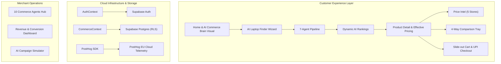

# CommercePilot AI — Animated AI Laptop Discovery & Agentic Commerce

> **Find the right laptop. See the real price. Let AI decide.**  
> An enterprise-grade, autonomous multi-agent commerce and growth platform designed for high-performance laptop discovery, dynamic price intelligence, and agentic retail optimization.

[](https://react.dev)
[](https://www.typescriptlang.org/)
[](https://vitejs.dev)
[](https://tailwindcss.com)
[](https://supabase.com)
[](https://posthog.com)
[](LICENSE)

---

## 🌟 Highlights & Capabilities

### 1. 🧠 Autonomous 7-Agent Discovery Pipeline
- **Profiling Agent**: Analyzes user workflow requirements across coding, machine learning, 3D rendering, college coursework, or gaming.
- **Spec Engine**: Dynamically matches CPU performance, GPU benchmark scores, unified RAM allocation, and display panels.
- **Ranking Engine**: Dynamically shifts algorithm weights (CPU, GPU, RAM, Battery, Display, Thermals) with real-time justification logs.

### 2. 💰 Price Intelligence & Effective Savings Calculator
- **Multi-Store Comparison**: Real-time pricing across Amazon, Flipkart, Croma, Reliance Digital, and Brand Official Stores.
- **Bank & Card Offer Engine**: Automatic deduction of instant discounts, debit/credit EMI perks, and promo vouchers to reveal the **true out-of-pocket cost**.
- **Price History Trends**: 90-day tracking to highlight all-time lows and optimal buy timings.

### 3. ⚖️ 4-Way Side-by-Side Comparison Matrix
- Compare up to 4 laptops simultaneously across 25+ attributes.
- Smart visual difference highlighting for clock speeds, panel response rates, port selections, and upgradeability.

### 4. 🔐 Supabase Authentication & Multi-Tenant Data Isolation
- Secure Email & Password authentication with session persistence.
- Row-Level Security (RLS) policies guaranteeing private carts, wishlists, order histories, and search sessions per user.
- One-click demo personas (**Developer**, **Student**, **Merchant**) for instant evaluation.

### 5. 📊 PostHog Product Telemetry & Session Replay
- Full integration with PostHog EU Cloud (`https://eu.i.posthog.com`).
- Single-page application (SPA) client-side route tracking.
- E-commerce lifecycle telemetry: `cart_item_added`, `product_searched`, `comparison_item_added`, `order_placed`.
- Masked session replays for diagnostic feedback and UX optimization.

### 6. 📈 Merchant Growth Hub & Campaign Simulator
- Real-time conversion metrics, funnel leak detection, and inventory velocity monitoring.
- Autonomous AI Marketing Agent simulating personalized campaign ROI and audience segment impact.

---

## 🏗️ Architecture



---

## 🚀 Getting Started

### Prerequisites
- [Node.js](https://nodejs.org/) (v18 or higher recommended)
- [npm](https://www.npmjs.com/)

### Installation

1. **Clone the repository:**
   ```bash
   git clone https://github.com/Ganu0124/CommercePilot-AI-Animated-AI-Laptop-Discovery-Agentic-Commerce-.git
   cd CommercePilot-AI-Animated-AI-Laptop-Discovery-Agentic-Commerce-
   ```

2. **Install dependencies:**
   ```bash
   npm install
   ```

3. **Configure Environment Variables:**
   Copy the `.env.example` template:
   ```bash
   cp .env.example .env
   ```
   Provide your Supabase and PostHog credentials:
   ```env
   # Supabase Configuration
   VITE_SUPABASE_URL=https://your-project-id.supabase.co
   VITE_SUPABASE_ANON_KEY=your-supabase-anon-key

   # PostHog Analytics & Session Replay (EU Cloud)
   VITE_POSTHOG_KEY=phc_your_posthog_project_api_key
   VITE_POSTHOG_HOST=https://eu.i.posthog.com
   ```

4. **Run the Development Server:**
   ```bash
   npm run dev
   ```
   Open your browser at `http://localhost:5173`.

5. **Build for Production:**
   ```bash
   npm run build
   ```

---

## 🌐 Deploying to Render

This repository is optimized for deployment on [Render](https://render.com) using either **Web Service** (full-stack Node.js) or **Static Site** (client bundle):

### Option 1: Render Web Service (Recommended — Full API & App)
1. In Render Dashboard, click **New +** $\rightarrow$ **Web Service**.
2. Connect this GitHub repository: `https://github.com/Ganu0124/CommercePilot-AI-Animated-AI-Laptop-Discovery-Agentic-Commerce-`.
3. Configure the service:
   - **Runtime**: `Node`
   - **Node Version**: Handled automatically by `.node-version` (v22.12.0)
   - **Build Command**: `npm install && npm run build`
   - **Start Command**: `npm start`
4. Environment Variables (optional, defaults provided):
   - `PORT`: `5000` (Render will bind to `0.0.0.0`)
   - `NODE_ENV`: `production`
   - `VITE_SUPABASE_URL`: Your Supabase URL
   - `VITE_SUPABASE_ANON_KEY`: Your Supabase Anon Key
   - `VITE_POSTHOG_KEY`: Your PostHog project key
   - `VITE_POSTHOG_HOST`: `https://eu.i.posthog.com`
5. Click **Create Web Service**.

### Option 2: Render Static Site (Client Only)
1. In Render Dashboard, click **New +** $\rightarrow$ **Static Site**.
2. Connect this repository.
3. Configure:
   - **Build Command**: `npm run build`
   - **Publish Directory**: `dist`
4. SPA Routing: Automatically handled by `public/_redirects` included in this repository.

### Option 3: One-Click Render Blueprint
Simply select **New +** $\rightarrow$ **Blueprint** on Render; it will read `render.yaml` and configure everything automatically.

---

## 📂 Project Structure

```
├── scripts/                # Supabase database migration & RLS isolation tests
│   ├── migrate-supabase.ts
│   └── test-rls-isolation.ts
├── src/
│   ├── components/         # Reusable UI widgets, drawers, modals & comparison tray
│   ├── context/            # AuthContext (Supabase) & CommerceContext (State engine)
│   ├── data/               # Product catalog, agent definitions, market rates
│   ├── lib/                # Supabase client & PostHog telemetry module
│   ├── pages/              # 11 core routes (Home, Shop, Finder, Compare, Growth, etc.)
│   ├── services/           # Data services (Cart, Orders, Products, Searches, Users)
│   ├── types/              # Comprehensive TypeScript data contracts
│   ├── App.tsx             # Route management & SPA pageview tracking
│   └── main.tsx            # React root & PostHog bootstrapping
├── index.html              # HTML entry point with Bricolage Grotesque typography
├── server.js               # Express API for UPI QR intent generation & health checks
└── package.json            # Scripts & project dependencies
```

---

## 📜 License

This project is licensed under the [MIT License](LICENSE).


## Author
## Ganesh M
